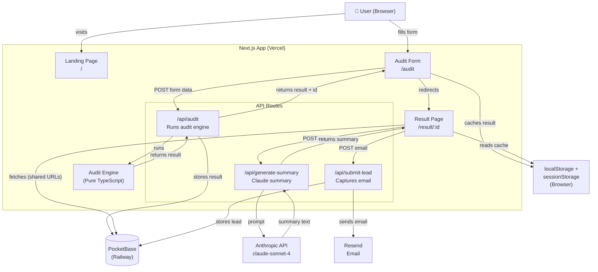

# Architecture

## System Diagram

## Data Flow

**A user's input → audit result:**

1. User fills the form (`/audit`): selects tools, enters plan/spend/seats, chooses use case
2. Form POSTs to `/api/audit`
3. API validates with Zod, checks rate limit against PocketBase `rate_limits` collection
4. `runAudit()` in `audit-engine.ts` processes each enabled tool through its evaluator function
5. Each evaluator returns a `ToolRecommendation` with defensible reasoning and savings calculation
6. Result is stored to PocketBase `audits` collection with a `share_token`
7. Result is returned to client, cached in both `sessionStorage` and `localStorage`
8. User is redirected to `/result/:id`
9. Result page reads from `localStorage`/`sessionStorage` (instant, works across tabs), triggers `/api/generate-summary`
10. Summary API sends the audit to Anthropic API, returns 90–120 word summary
11. User can email themselves → `/api/submit-lead` stores to PocketBase `leads` collection, sends via Resend

**Shared URL flow:** External visitor hits `/result/:id` → Next.js server fetches from PocketBase (Railway) → SSR renders OG tags → client hydrates.

**Email link flow:** User clicks "View Full Report" in email → opens result page in new tab → `localStorage` has the audit data (same device) → loads instantly without DB roundtrip.

## Stack Decisions

| Layer | Choice | Why |
|-------|--------|-----|
| Framework | Next.js 14 (App Router) | SSR for OG tags, API routes, deploy on Vercel in one command |
| Language | TypeScript | Strict types prevent class of bugs in financial calculations |
| Styling | Tailwind CSS | Utility-first, consistent design system, no CSS file bloat |
| Database | PocketBase (Railway) | Single binary, built-in REST API + admin UI, zero vendor lock-in, free on Railway |
| Email | Resend | Developer-first, fast setup, 3000 free emails/month |
| AI | Anthropic API (claude-sonnet-4) | Per assignment requirement; excellent at concise prose |
| Deploy | Vercel (app) + Railway (PocketBase) | Zero-config Next.js on Vercel; Railway for persistent PocketBase process |
| Testing | Jest + ts-jest | Standard, fast, integrates with Next.js |

## Scaling to 10k Audits/Day

Current architecture handles ~2,000 audits/day comfortably on Railway's free tier. To handle 10k/day:

1. **Database:** Upgrade Railway PocketBase to a paid plan with persistent volume and more RAM. Alternatively migrate to Turso (distributed SQLite, edge-native) or Neon (serverless Postgres) — PocketBase's REST API makes migration straightforward since the app layer is already abstracted in `src/lib/pocketbase.ts`
2. **Rate limiting:** Move from PocketBase-based rate limiting to Redis (Upstash free tier) for O(1) lookups instead of REST API calls — reduces latency from ~50ms to ~2ms per rate limit check
3. **API routes:** Already serverless on Vercel — auto-scales horizontally with zero config
4. **Anthropic API:** Implement request queuing with a Vercel Queue or BullMQ + Redis to avoid 429s; the summary generation is non-blocking so users see results immediately
5. **Caching:** Add Redis cache on result fetches (`/result/:id`) — same audit shouldn't hit PocketBase on every share link click. `localStorage` already handles same-device caching
6. **Analytics:** Add PostHog for funnel analysis (form start → audit complete → email capture) to optimize conversion

The audit engine itself is pure synchronous TypeScript with O(n) on tool count — never a bottleneck.
