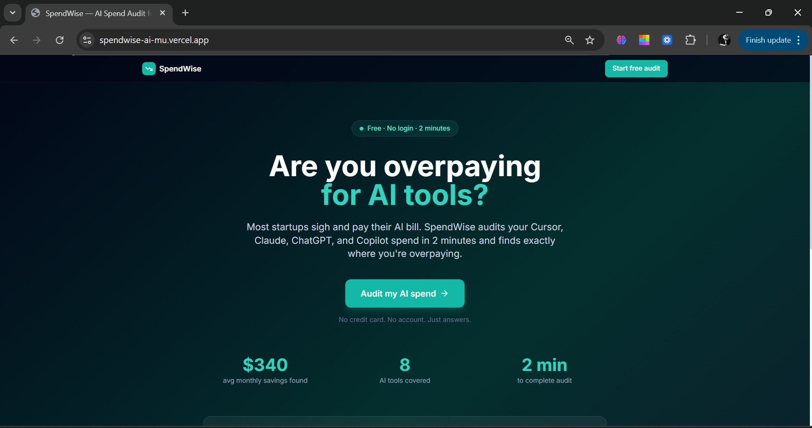
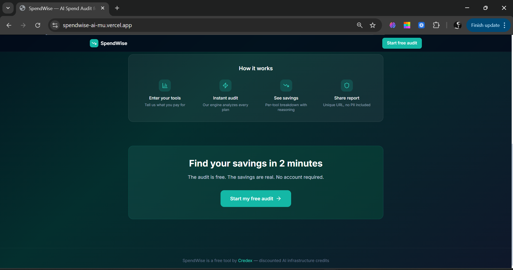
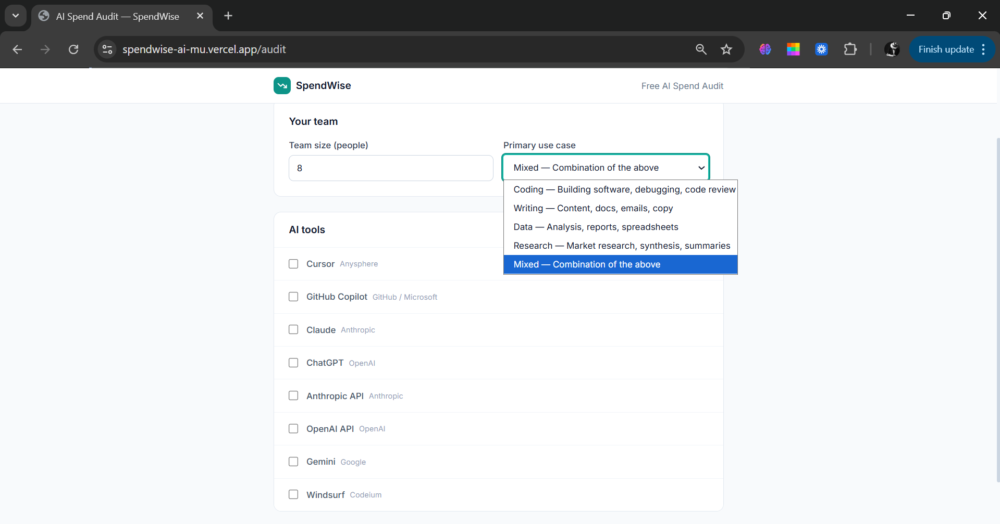
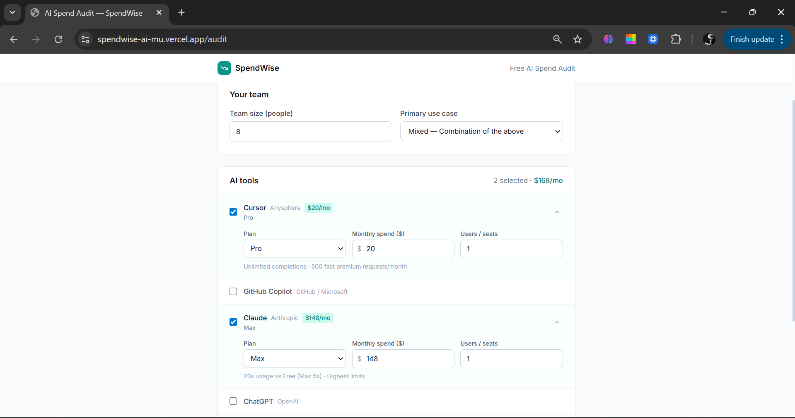
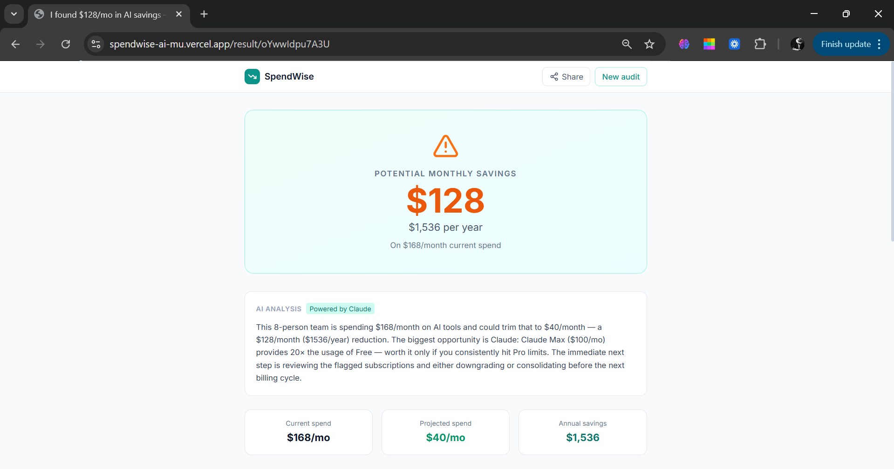
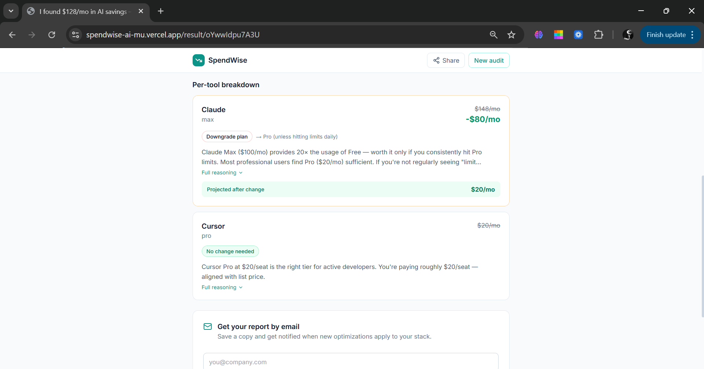
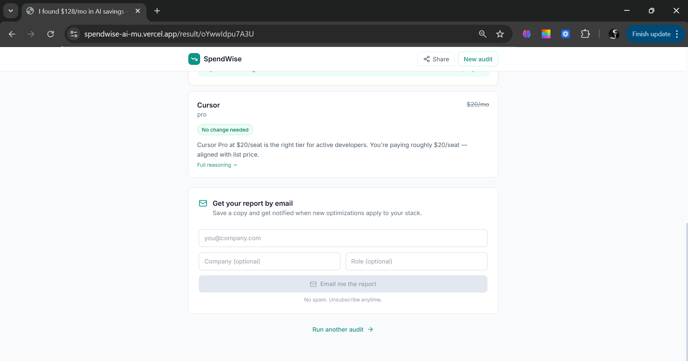
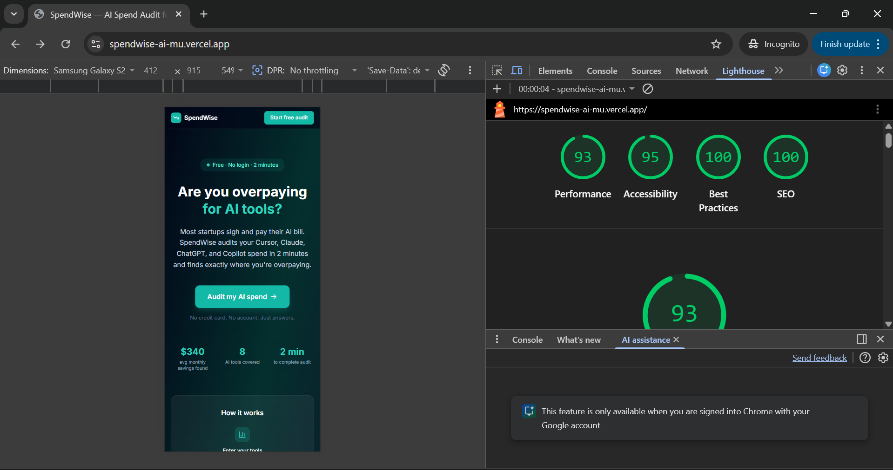

<div align="center">



# SpendWise — AI Spend Audit for Startups

**Find out in 2 minutes if you're overpaying for AI tools.**

SpendWise audits your Cursor, GitHub Copilot, Claude, ChatGPT, and more — and tells you exactly where you're overpaying, what to switch, and how much you'll save. Built for startup founders and engineering managers who pay AI bills without a second opinion.

[](https://spendwise-ai-mu.vercel.app/)
[](https://nextjs.org/)
[](https://www.typescriptlang.org/)
[](https://pocketbase.io/)
[](https://github.com/haseeb-28/spendwise-ai/actions)

**🔗 Live URL: [https://spendwise-ai-mu.vercel.app](https://spendwise-ai-mu.vercel.app/)**

</div>

---

## ✨ What It Does

| Step | Description |
|------|-------------|
| 1️⃣ | Cold visitor lands from a tweet, blog post, or Hacker News |
| 2️⃣ | Enters AI tools they pay for — plan, monthly spend, team size |
| 3️⃣ | Gets an **instant on-screen audit** — where they're overspending and why |
| 4️⃣ | Receives the report by **email** (captured after value is shown, never before) |
| 5️⃣ | Shares via a **unique public URL** with Open Graph previews |

---

## 📸 Screenshots

### Landing Page



### Audit Form



### Results



### Lead Capture


### Lighthouse mobile scores 


---

## 🚀 Quick Start

### Prerequisites

- **Node.js 18+** — [nodejs.org](https://nodejs.org)
- **PocketBase** — [pocketbase.io](https://pocketbase.io) (free, self-hosted)
- **Resend account** — [resend.com](https://resend.com) (free tier, 3k emails/month)
- **Anthropic API key** — [console.anthropic.com](https://console.anthropic.com)

### Install & Run Locally

```bash
# 1. Clone the repo
git clone https://github.com/haseeb-28/spendwise-ai
cd spendwise-ai

# 2. Install dependencies
npm install

# 3. Set up environment variables
cp .env.local.example .env.local
# Fill in your values (see Environment Variables section below)

# 4. Start PocketBase in a separate terminal
cd pb && ./pocketbase serve        # Mac/Linux
cd pb && pocketbase.exe serve      # Windows

# 5. Run the dev server
npm run dev
```

Open [http://localhost:3000](http://localhost:3000) — you should see the landing page.

### Run Tests

```bash
npm test                  # Run all tests
npm run test:coverage     # Run with coverage report
```

---

## 🔑 Environment Variables

Create a `.env.local` file in the project root:

```env
# ── PocketBase ─────────────────────────────────────────────
POCKETBASE_URL=http://127.0.0.1:8090        # Local dev
# POCKETBASE_URL=https://your-app.railway.app  # Production

POCKETBASE_ADMIN_EMAIL=admin@example.com
POCKETBASE_ADMIN_PASSWORD=your_strong_password

# ── Anthropic API ───────────────────────────────────────────
ANTHROPIC_API_KEY=sk-ant-api03-...          # console.anthropic.com

# ── Resend (Email) ──────────────────────────────────────────
RESEND_API_KEY=re_xxxxxxxxxxxx              # resend.com
RESEND_FROM_EMAIL=onboarding@resend.dev     # Or your verified domain

# ── App ────────────────────────────────────────────────────
NEXT_PUBLIC_APP_URL=http://localhost:3000   # Your deployed URL in production
```

---

## 🗄️ Database Setup (PocketBase)

### 1. Run PocketBase locally

```bash
# Download from pocketbase.io, then:
./pocketbase serve
# Open http://127.0.0.1:8090/_/ → create admin account
```

### 2. Create 3 Collections in the PocketBase Admin UI

<details>
<summary><strong>📋 audits collection</strong> (click to expand)</summary>

| Field | Type | Required | Notes |
|-------|------|----------|-------|
| `audit_id` | Text | ✅ | |
| `form_data` | JSON | ✅ | |
| `recommendations` | JSON | ✅ | |
| `total_monthly_spend` | Number | ✅ | |
| `total_projected_spend` | Number | ✅ | |
| `total_monthly_savings` | Number | ✅ | |
| `total_annual_savings` | Number | ✅ | |
| `overall_assessment` | Text | ✅ | |
| `ai_summary` | Text | ❌ | |
| `share_token` | Text | ✅ | Set as **Unique** |

</details>

<details>
<summary><strong>📋 leads collection</strong> (click to expand)</summary>

| Field | Type | Required |
|-------|------|----------|
| `email` | Email | ✅ |
| `company_name` | Text | ❌ |
| `role` | Text | ❌ |
| `team_size` | Number | ❌ |
| `audit_id` | Text | ❌ |
| `total_monthly_savings` | Number | ❌ |
| `high_savings` | Bool | ❌ |
| `email_sent` | Bool | ❌ |

</details>

<details>
<summary><strong>📋 rate_limits collection</strong> (click to expand)</summary>

| Field | Type | Required |
|-------|------|----------|
| `ip` | Text | ✅ |
| `count` | Number | ✅ |
| `window_start` | Date | ✅ |

</details>

### 3. Unlock API Rules

For **each** collection → API Rules tab → unlock all rules (set to empty).

---

## ☁️ Deploy to Production

### PocketBase → Railway

Create a new GitHub repo with this `Dockerfile` and deploy on [railway.app](https://railway.app):

```dockerfile
FROM alpine:latest
ARG PB_VERSION=0.22.20
RUN apk add --no-cache unzip ca-certificates wget
RUN wget https://github.com/pocketbase/pocketbase/releases/download/v${PB_VERSION}/pocketbase_${PB_VERSION}_linux_amd64.zip \
    -O /tmp/pb.zip && unzip /tmp/pb.zip -d /pb/ && rm /tmp/pb.zip
RUN chmod +x /pb/pocketbase
EXPOSE 8090
VOLUME /pb/pb_data
CMD ["/pb/pocketbase", "serve", "--http=0.0.0.0:8090", "--dir=/pb/pb_data"]
```

Then: Railway → Generate Domain → recreate collections there → copy URL to Vercel env vars.

### Next.js App → Vercel

```bash
npm install -g vercel
vercel --prod
# Add all 7 environment variables in Vercel dashboard → Redeploy
```

---

## 🏗️ Project Structure

```
spendwise-ai/
├── src/
│   ├── app/
│   │   ├── api/
│   │   │   ├── audit/          # Runs audit engine, stores result
│   │   │   ├── generate-summary/  # Anthropic API integration
│   │   │   └── submit-lead/    # Lead capture + Resend email
│   │   ├── audit/              # Audit form page
│   │   ├── result/[id]/        # Results page (SSR + OG tags)
│   │   └── page.tsx            # Landing page
│   ├── components/
│   │   ├── AuditForm.tsx       # Multi-tool input form
│   │   └── AuditResultClient.tsx  # Results display + lead capture
│   ├── lib/
│   │   ├── audit-engine.ts     # Core audit logic (pure TypeScript)
│   │   ├── pocketbase.ts       # Database client
│   │   ├── pricing-data.ts     # All tool pricing (cited sources)
│   │   └── utils.ts            # Shared utilities
│   └── types/index.ts          # TypeScript type definitions
├── screenshots/                # README screenshots
├── .github/workflows/ci.yml    # GitHub Actions CI
├── ARCHITECTURE.md
├── DEVLOG.md
├── ECONOMICS.md
├── GTM.md
├── LANDING_COPY.md
├── METRICS.md
├── PRICING_DATA.md
├── PROMPTS.md
├── REFLECTION.md
├── TESTS.md
└── USER_INTERVIEWS.md
```

---

## ⚖️ Decisions (5 Trade-offs)

**1. Next.js 14 App Router over plain React SPA**
Chose Next.js for SSR on result pages — critical for Open Graph tags, which require server-rendered metadata so share links render rich previews on Twitter and Slack. The audit form is purely client-side; only the result page needs SSR. Trade-off: more complex deploy, but Vercel removes all friction with zero-config Next.js support.

**2. Hardcoded audit engine over AI-generated recommendations**
The audit logic is deterministic rule-based TypeScript, not a prompt. A finance person needs to audit the reasoning, and LLM outputs aren't consistent enough for defensible financial recommendations. AI is only used for the 90–120 word summary paragraph — a well-scoped use of non-determinism where consistency matters less than quality of prose.

**3. PocketBase over Supabase or Neon**
PocketBase is a single binary with a built-in admin UI, auto-generated REST API, and zero vendor lock-in. Runs locally with one command and deploys on Railway with a Dockerfile. Trade-off: requires managing a separate server process, but removes all third-party account dependencies and gives full data control.

**4. Resend over SendGrid or AWS SES**
Resend has a developer-first API that takes under 10 minutes to set up with a generous free tier (3,000 emails/month). SES requires domain verification, IAM roles, and sandbox approval — too much friction for a 7-day sprint. Trade-off: slightly higher cost at scale, but dramatically faster to ship.

**5. localStorage + sessionStorage for result hydration**
Audit results are saved to both `sessionStorage` and `localStorage` after running. `sessionStorage` gives instant same-tab loads; `localStorage` means the result page loads even when opened in a new tab from an email link on the same device. The database is only hit for shared URLs opened on a different device. Trade-off: stale data if audit engine logic changes, but irrelevant at this scale.

---

## 🧪 MVP Features Checklist

- [x] **Spend input form** — 8 tools, plan/seats/spend, persists across reloads
- [x] **Audit engine** — defensible rule-based logic, cited pricing data
- [x] **Results page** — per-tool breakdown, hero savings number, Credex CTA for >$500/mo
- [x] **AI-generated summary** — Anthropic API with graceful fallback
- [x] **Lead capture** — email gate after value shown, PocketBase storage, Resend email
- [x] **Shareable URL** — unique per audit, PII stripped, Open Graph tags

---

<div align="center">

**SpendWise** · Free AI spend optimization · Built for [Credex](https://credex.rocks)

Developed by **Haseeb Ur Rehman** as part of the Credex Web Dev Intern Assignment
</div>
